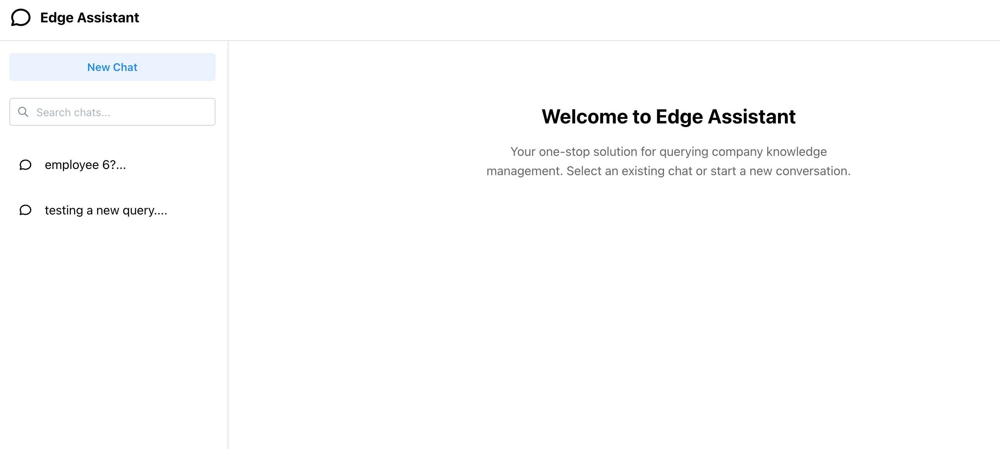

# Edge Assistant

## Objective

Develop a full-stack application featuring:
- React-based chat interface for user interactions
- Backend API integration for intelligent question handling
- Hybrid response system combining:
  - Dataset-specific queries (employee salary data)
  - General knowledge questions via LLM
- RAG (Retrieval-Augmented Generation) pipeline implementation



## Key Features

### Frontend (React)
- Interactive chat interface with:
  - Real-time message streaming
  - Conversation history sidebar
  - Searchable chat history
- Markdown support for formatted responses

### Backend (Django)
- Dataset-specific statistical operations:
  - Departmental salary calculations (median, max, min)
  - Employee record queries
- General knowledge responses via LLM integration
- Asynchronous task processing with Celery
- Vector database integration (Pinecone) for RAG
- REST API endpoints for chat management

#### LLM Providers: OpenAI 
#### Vector Databases: Pinecone 

### Dataset Analysis
- Employee records containing:
  | Name        | Department | Salary    |
  |-------------|------------|-----------|
  | Employee_1  | HR         | $65,000   |
  | Employee_2  | IT         | $90,000   |
  | Employee_3  | Finance    | $78,000   |
  | ...         | ...        | ...       |
- Automated statistical processing:
  - Departmental salary aggregations
  - Employee compensation analytics
  - Data chunking for vector storage

## System Requirements

### Frontend
- Node.js v20.x
- npm v10.x

### Backend
- Redis (for task queue)
- UV package manager ([Installation Guide](https://docs.astral.sh/uv/getting-started/installation/#standalone-installer))

## Installation & Execution

### Frontend Setup
```bash
cd frontend
npm install    # Install dependencies
npm run dev    # Start development server
```
Access application at: `http://localhost:5173`

### Backend Setup

After changing the directory to `backend`, follow the steps below:

1. Create `.env` configuration:
```bash
############# DJANGO CONFIGURATIONS ##############
LOGGING_LEVEL=INFO
DJANGO_SECRET_KEY=your-secret-key-here

############# RAG CONFIGURATIONS ##############
OPENAI_API_KEY=your-openai-key
EMBEDDING_MODEL=text-embedding-3-small
CHAT_MODEL=gpt-4o

PINECONE_API_KEY=your-pinecone-key
PINECONE_INDEX_NAME=your-index-name
PINECONE_INDEX_DIMS=1536
EOF
```

2. Initialize environment:
```bash
uv venv              # Create virtual environment
source .venv/bin/activate  # Activate environment
uv sync              # Install dependencies
python manage.py migrate  # Initialize database
```

3. Dataset Indexing:

Run `python manage.py embed_dataset` to index the Fae Employee Dataset into Pinecone.


4. Start services:
```bash
redis-server &              # Start Redis in background
python manage.py runserver  # Start Django backend
celery -A core worker -l info  # Start Celery worker
```